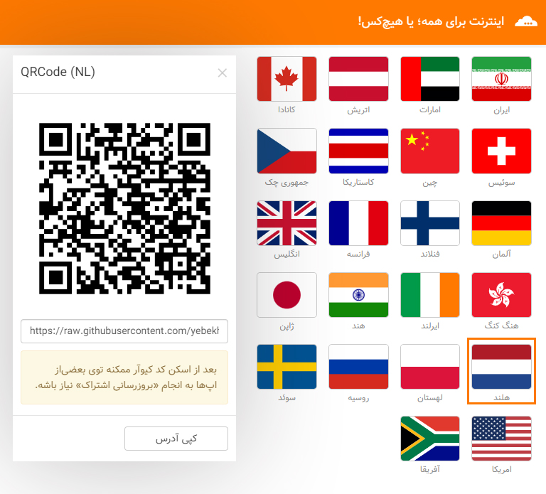

# Free v2ray Config Based on Location
کانفیگ‌های رایگان v2ray بر اساس لوکیشن ...

* این‌ابزار کانفیگ‌های رایگان گردآوری شده از طریق کانال‌های تلگرامی رو بر اساس لوکیشن دسته‌بندی میکنه و میتونین توسط V2rayn, V2rayng, Foxray یا Streisand ازشون استفاده کنین.
* این‌کانفیگ‌ها توسط ریپازیتوری TVC و به‌صورت خودکار جمع‌آوری میشن و از طریق این‌ابزار در دسترس عموم قرار میگیرن.
* ممکنه بعضی‌از لینک‌های ساب با خطای 404 مواجه بشن یا یک لوکیشن قبلا بوده باشه و الان نباشه؛ که دلیلش عدم در دسترس بودن کانفیگ‌های یک لوکیشن در همون‌بازه زمانی هست.
* آی‌پی‌ها برای دسته‌بندی کانفیگ‌ها بر اساس لوکیشن با یک دیتابیس تطابق داده میشن، که ممکنه گاهی اشتباه داشته باشه.
* برای رعایت مسائل امنیتی توصیه میشه تنها برای مصارف عادی ازشون استفاده کنین.

دریافت نرم افزار موردنیاز : 
https://ircf.space/software.php

آموزش استفاده : 
https://youtube.com/watch?v=MNqsR8F6JWs&t=125s